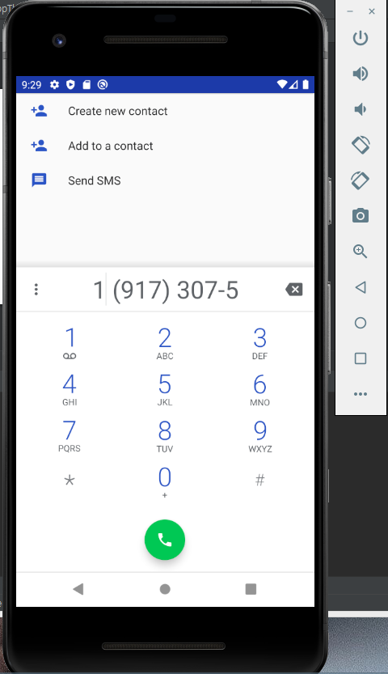
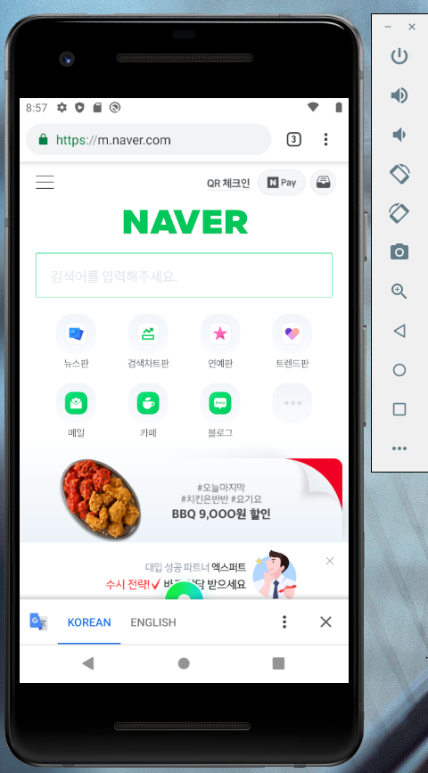

# 19173075 박채현

## 1주차과제

## 2주차과제
   </img>

## 3주차과제
   </img>
   </img>
   
## 4주차과제

      - 아이디어 명 : 애완동물 커뮤니티 앱
      - 현재 '아지냥이' 라는 앱이 존재하지만 유저들끼리 (sns처럼)커뮤니티를 한다기 보다는 수의사들과의 대화가 주를 차지하며
       유기견 보호와 관련된 앱이라고 볼 수 있다. 요즘은 애완동물을 키우는 인구가 증가하면서 sns에서도 쉽게 애완동물에 관련된 
       계정을 찾을 수 있다. 이런 애완동물을 키우는 사람들을 위해 서로 애완동물을 키우면서 알게 된 정보를 공유할 수 있는 sns를 
       만들면 서로 소통할 수 있고 처음 애완동물을 키우는 사람도 모르는 정보를 알아갈 수 있다.
       
       
## 7주차과제

